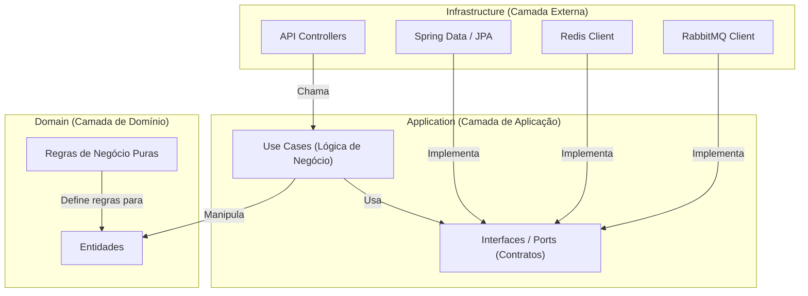
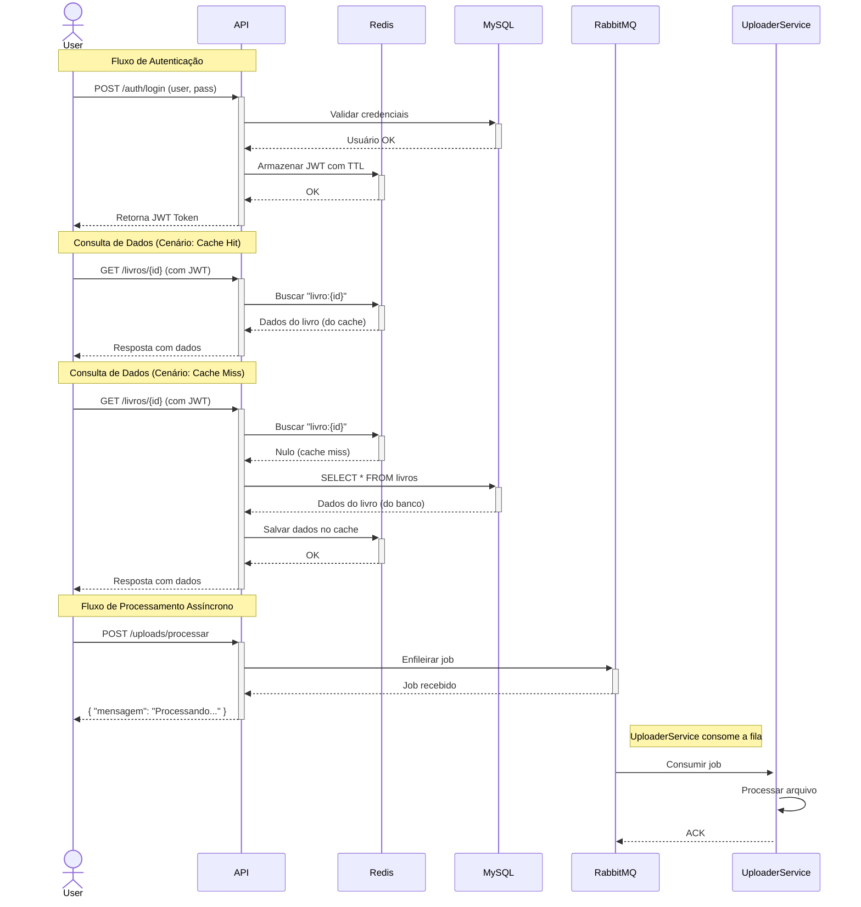

# Lottus Library - Backend

Backend da aplicação Lottus, uma API de gerenciamento de biblioteca desenvolvida com Spring Boot, seguindo os princípios da Clean Architecture e com foco em alta performance e escalabilidade.

## ⚠️ Licença de Uso - Importante

Este projeto foi desenvolvido pela equipe **Lottus Solutions** como uma iniciativa beneficente e seu código é disponibilizado publicamente **exclusivamente para fins de consulta, estudo e inspiração**.

Conforme a [LICENÇA DE USO](LICENSE.md), é **expressamente proibido**:
- Redistribuir, republicar ou clonar o projeto para uso próprio (seja acadêmico, comercial ou não comercial).
- Modificar, adaptar ou criar obras derivadas com base neste código.
- Utilizar o nome "Lottus Solutions" sem consentimento prévio.

Para qualquer outra finalidade, por favor, entre em contato com a equipe.

---

## Tecnologias e Suas Funções

| Tecnologia | Função Principal |
| :--- | :--- |
| **Java 21** | Linguagem de programação principal, oferecendo recursos modernos e performance. |
| **Spring Boot 3** | Framework base para a construção da API, simplificando a configuração e o desenvolvimento. |
| **Spring Data JPA** | Facilita a persistência de dados e a comunicação com o banco de dados relacional. |
| **Spring Security** | Gerencia a autenticação e autorização, protegendo os endpoints da API. |
| **MySQL** | Banco de dados relacional principal, responsável pela persistência definitiva dos dados (usuários, livros, etc.). |
| **Redis** | Utilizado para duas finalidades críticas: (1) **cache de alta velocidade** para consultas frequentes, reduzindo a latência, e (2) **armazenamento temporário (com TTL)** de tokens JWT, controlando sessões de forma eficiente. |
| **RabbitMQ** | **Message Broker** que desacopla processos assíncronos. É usado para enfileirar tarefas pesadas, como o processamento de arquivos de upload, que são consumidas por um serviço separado (`uploader`). |
| **Maven** | Gerenciador de dependências e automação de build do projeto. |
| **Docker** | Permite a criação de ambientes consistentes e isolados para os serviços (MySQL, Redis, etc.). |
| **JWT** | Padrão de token para a autenticação segura e stateless entre o cliente e o servidor. |
| **Springdoc OpenAPI**| Gera automaticamente a documentação interativa da API (Swagger UI). |

## Arquitetura

O projeto segue os princípios da **Clean Architecture**, garantindo um código desacoplado, testável e de fácil manutenção. A regra principal é que as dependências sempre apontam para dentro, do mais externo (frameworks, UI) para o mais interno (regras de negócio).



Abaixo, um diagrama que ilustra o fluxo de deploy e a interação entre os serviços no ambiente de produção:

```mermaid
graph TD;
    subgraph "Ambiente de Desenvolvimento"
        A[Código-fonte no GitHub]
    end
    
    subgraph "CI/CD Pipeline (GitHub Actions)"
        B{Commit na branch 'main'} --> C[1. Build & Test];
        C --> D[2. Build da Imagem Docker];
        D --> E[3. Push para o Docker Hub];
    end

    subgraph "Ambiente de Produção"
        E -- "4. Deploy" --> F[API Backend (Java)];
        F -- "Acessa" --> G[Banco de Dados MySQL];
        F -- "Usa para cache" --> H[Cache Redis];
        F -- "Enfileira jobs em" --> I[Message Broker RabbitMQ];
    end

    A --> B;
```

- **Domain**: Camada mais interna. Contém as entidades de negócio (`Livro`, `Aluno`) e as regras que não dependem de nenhuma tecnologia externa.
- **Application**: Orquestra os fluxos de negócio (Casos de Uso) e define as interfaces (Ports) que a camada de infraestrutura deve implementar.
- **Infrastructure**: Camada mais externa. Contém os detalhes de implementação, como os Controllers da API, a conexão com o banco de dados, o cache e o message broker.

## Fluxo de Dados e Comunicação

O diagrama abaixo ilustra como as tecnologias interagem em diferentes cenários, como autenticação, consulta de dados (com e sem cache) e processamento assíncrono.



## Pré-requisitos

- **Java 21 ou superior**
- **Maven 3.6 ou superior**
- **Docker e Docker Compose**

## Como Configurar e Iniciar o Projeto

1.  **Clone o Repositório**
    ```bash
    git clone https://github.com/Lottus-Solutions/lottus-backend-cleanarch.git
    cd lottus-backend-cleanarch
    ```

2.  **Configure as Variáveis de Ambiente**
    O projeto utiliza o `compose.yaml` para orquestrar os serviços. As credenciais padrão estão definidas nele e no `application.properties`. Certifique-se de que as portas `3306` (MySQL) e `6379` (Redis) estejam livres em sua máquina.

3.  **Inicie os Contêineres Docker**
    Para iniciar o MySQL e o Redis, use o Docker Compose:
    ```bash
    docker compose up -d
    ```

4.  **Execute a Aplicação Spring Boot**
    Use o Maven Wrapper para compilar e executar o projeto:
    ```bash
    ./mvnw spring-boot:run
    ```
    Alternativamente, gere o pacote e execute-o:
    ```bash
    ./mvnw clean install
    java -jar target/library-0.0.1-SNAPSHOT.jar
    ```

5.  **Acesse a Aplicação**
    - **API**: `http://localhost:8080`
    - **Documentação (Swagger UI)**: `http://localhost:8080/swagger-ui.html`

## Endpoints da API

A API fornece um conjunto completo de endpoints para o gerenciamento da biblioteca. Abaixo estão os principais, agrupados por recurso.

-   **Autenticação**
    -   `POST /auth/login`: Autenticação de usuário e obtenção de token JWT.
    -   `POST /auth/logout`: Invalida o token JWT do usuário.

-   **Usuários (`/usuarios`)**
    -   `POST /`: Cadastra um novo usuário.
    -   `GET /`: Lista todos os usuários.
    -   `GET /me`: Retorna os dados do usuário logado.
    -   `PUT /`: Edita os dados do usuário logado.

-   **Alunos (`/alunos`)**
    -   `POST /`: Cadastra um novo aluno.
    -   `GET /`: Lista todos os alunos.
    -   `GET /matricula/{matricula}`: Busca um aluno por matrícula.
    -   `PUT /`: Edita um aluno existente.
    -   `DELETE /{id}`: Remove um aluno.

-   **Livros (`/livros`)**
    -   `POST /`: Cadastra um novo livro.
    -   `GET /`: Lista e filtra todos os livros.
    -   `GET /historico/{id}`: Exibe o histórico de empréstimos de um livro.
    -   `PUT /`: Atualiza um livro existente.
    -   `DELETE /{id}`: Remove um livro.

-   **Categorias (`/categorias`)**
    -   `POST /`: Cadastra uma nova categoria.
    -   `GET /`: Lista todas as categorias.
    -   `DELETE /{id}`: Remove uma categoria.

-   **Turmas (`/turmas`)**
    -   `POST /`: Cadastra uma nova turma.
    -   `GET /`: Lista todas as turmas.
    -   `PUT /`: Edita uma turma existente.
    -   `DELETE /{id}`: Remove uma turma.

-   **Empréstimos (`/emprestimos`)**
    -   `POST /`: Realiza um novo empréstimo de livro para um aluno.
    -   `GET /`: Lista todos os empréstimos (com filtros).
    -   `GET /atrasados`: Lista os empréstimos em atraso.
    -   `POST /renovar/{id}`: Renova um empréstimo existente.
    -   `POST /finalizar/{id}`: Finaliza (devolve) um empréstimo.

-   **Uploads (`/uploads`)**
    -   `POST /processar-arquivo`: Envia um arquivo (ex: `.xlsx`) para processamento assíncrono via RabbitMQ.

> Para detalhes completos sobre os parâmetros e corpos de requisição/resposta, consulte a **[Documentação do Swagger](http://localhost:8080/swagger-ui.html)**.
